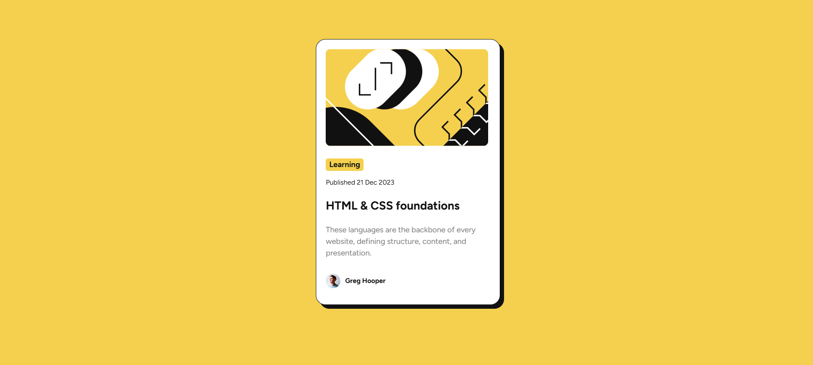

# Frontend Mentor - Blog preview card solution

This is a solution to the [Recipe page challenge on Frontend Mentor](https://www.frontendmentor.io/challenges/blog-preview-card-ckPaj01IcS). Frontend Mentor challenges help you improve your coding skills by building realistic projects. 

## Table of contents

- [Overview](#overview)
  - [The challenge](#the-challenge)
  - [Screenshot](#screenshot)
- [Built with](#built-with)
- [Solution URL](#solution-url)

## Overview

### The challenge

Build out the project to the designs provided

## Screenshot

## Built with

- React
- Vite
- TypeScript
- HTML
- CSS

## Solution URL

- GitHub - [https://github.com/jenniferom/blog-preview-card.git](https://github.com/jenniferom/blog-preview-card.git)
- Live Site - [https://blog-preview-card-seven-indol.vercel.app](https://blog-preview-card-seven-indol.vercel.app/)